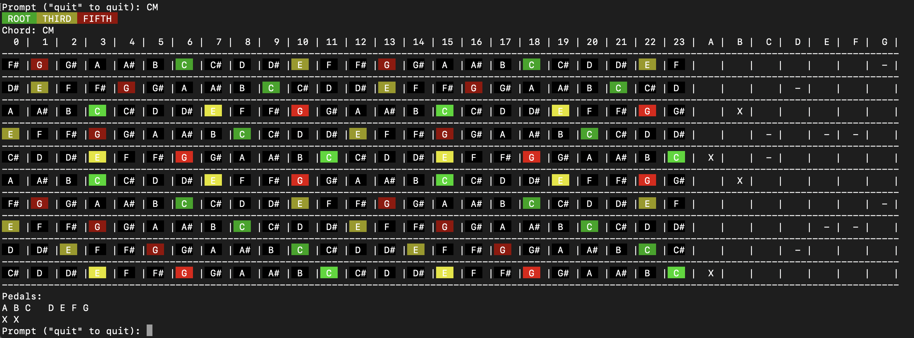
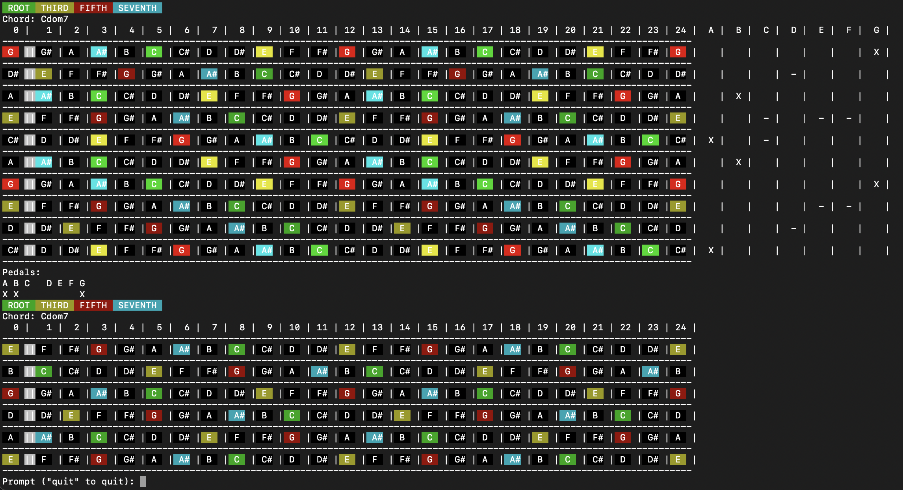

# psgguitar

Visualize notes on a pedal steel fretboard

run with `python main.py`.

run tests with `pytest`.

Specifying a chord will display it on the fretboard.  Replace C with whatever note you like.  You can tab-complete.  Currently it doesnt support "flat", only sharp, e.g. `C#M`

 * `CM` (Major chord)
 * `Cm` (Minor chord)
 * `Cdim` (Diminished chord)
 * `Caug` (Augmented chord)
 * `CM7` (Major 7th)
 * `Cm7` (Minor 7th)
 * `Cdim7` (Diminished 7th)
 * `Cdom7` (Dominant 7th)

You can actuate pedals with the following commands. It will toggle the state of the pedal.  A, B, C are the foot pedals. D, E, F G are the knee levers.
 * `pA`
 * `pB`
 * `pC`
 * `pD`
 * `pE`
 * `pF`
 * `pG`

`6str` toggles a display of a standard tuning 6 string guitar below the pedal steel fretboard

Example of showing a CMaj chord:

Example with a Cdom7 chord, including `6str` output for comparison to a standard guitar neck

